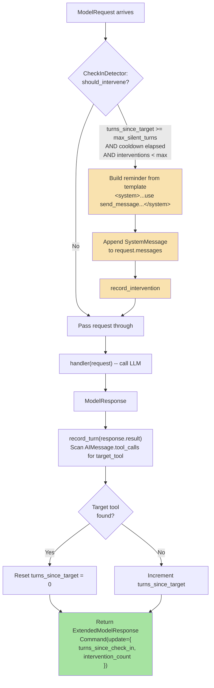

# Worker Check-In Monitor

```mermaid
flowchart TD
    A[ModelRequest arrives] --> B{CheckInDetector:<br/>should_intervene?}
    B -- "turns_since_target >= max_silent_turns<br/>AND cooldown elapsed<br/>AND interventions < max" --> C["Build reminder from template<br/>&lt;system&gt;...use send_message...&lt;/system&gt;"]
    C --> D["Append SystemMessage<br/>to request.messages"]
    D --> E[record_intervention]
    B -- No --> F[Pass request through]
    E --> F
    F --> G["handler(request) -- call LLM"]
    G --> H[ModelResponse]
    H --> I["record_turn(response.result)<br/>Scan AIMessage.tool_calls for target_tool"]
    I --> J{"Target tool<br/>found?"}
    J -- Yes --> K["Reset turns_since_target = 0"]
    J -- No --> L["Increment turns_since_target"]
    K --> M["Return ExtendedModelResponse<br/>Command(update={<br/>  turns_since_check_in,<br/>  intervention_count<br/>})"]
    L --> M

    style C fill:#f9e2af
    style D fill:#f9e2af
    style E fill:#f9e2af
    style M fill:#a6e3a1
```
