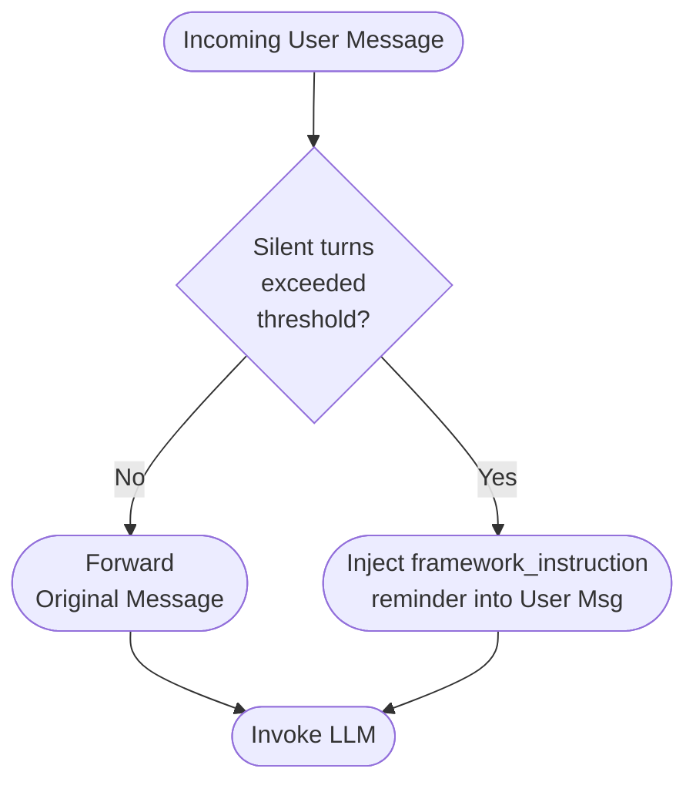

# Worker Check-In Monitor

```mermaid
flowchart TD
    A(["Incoming User Message"]) --> B{"Silent turns<br/>exceeded<br/>threshold?"}
    B -- No --> C(["Forward<br/>Original Message"])
    B -- Yes --> D(["Inject framework_instruction<br/>reminder into User Msg"])
    C --> E(["Invoke LLM"])
    D --> E
```
