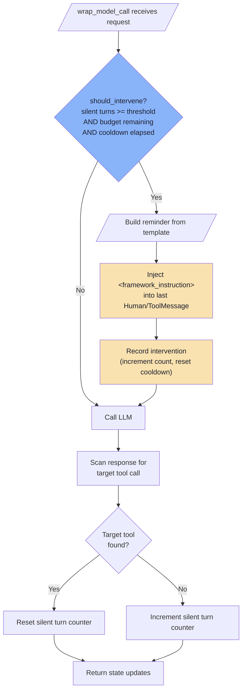

# Worker Check-In Monitor

```mermaid
flowchart TD
    A[/"wrap_model_call receives request"/] --> B{"should_intervene?<br/>silent turns >= threshold<br/>AND budget remaining<br/>AND cooldown elapsed"}

    B -- Yes --> C[/"Build reminder from template"/]
    C --> D["Inject &lt;framework_instruction&gt;<br/>into last Human/ToolMessage"]
    D --> E["Record intervention<br/>(increment count, reset cooldown)"]

    B -- No --> F

    E --> F[Call LLM]
    F --> G["Scan response for<br/>target tool call"]

    G --> H{"Target tool<br/>found?"}
    H -- Yes --> I["Reset silent turn counter"]
    H -- No --> J["Increment silent turn counter"]

    I --> K[Return state updates]
    J --> K

    style B fill:#89b4fa,color:#1e1e2e
    style D fill:#f9e2af,color:#1e1e2e
    style E fill:#f9e2af,color:#1e1e2e
```
