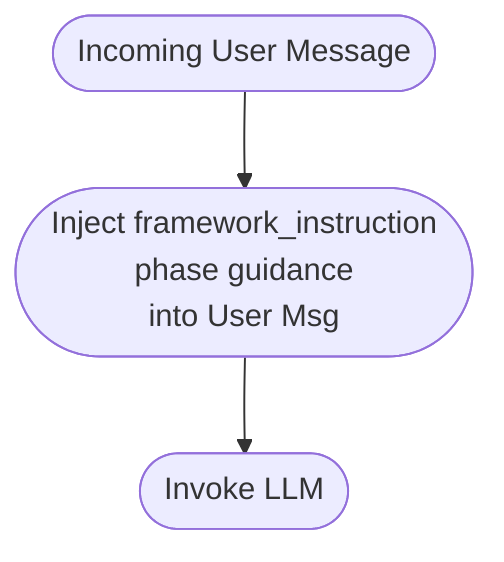
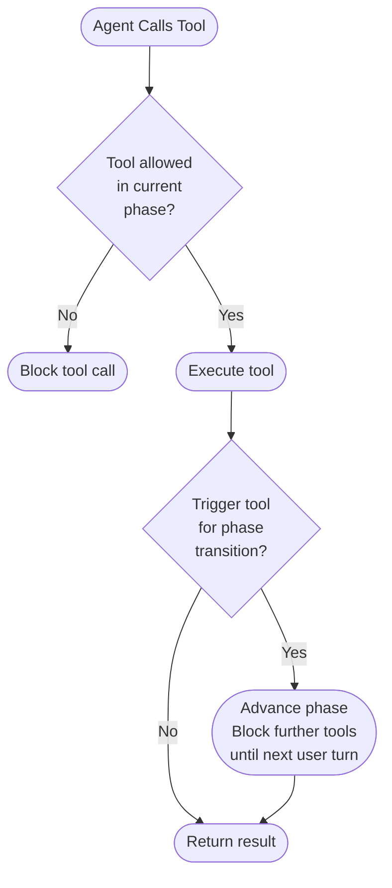
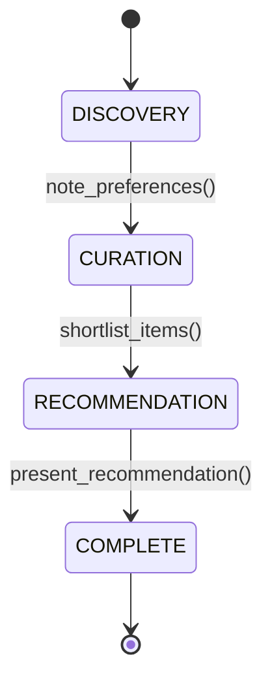

# Phase Steering

## Before Each LLM Call

```mermaid
flowchart TD
    A(["Incoming User Message"]) --> B(["Inject framework_instruction<br/>phase guidance<br/>into User Msg"])
    B --> C(["Invoke LLM"])
```

## On Each Tool Call

```mermaid
flowchart TD
    A(["Agent Calls Tool"]) --> B{"Tool allowed<br/>in current<br/>phase?"}
    B -- No --> C(["Block tool call"])
    B -- Yes --> D(["Execute tool"])
    D --> E{"Trigger tool<br/>for phase<br/>transition?"}
    E -- No --> F(["Return result"])
    E -- Yes --> G(["Advance phase<br/>Block further tools<br/>until next user turn"])
    G --> F
```

## Phase Progression

```mermaid
stateDiagram-v2
    [*] --> DISCOVERY
    DISCOVERY --> CURATION : note_preferences()
    CURATION --> RECOMMENDATION : shortlist_items()
    RECOMMENDATION --> COMPLETE : present_recommendation()
    COMPLETE --> [*]
```
