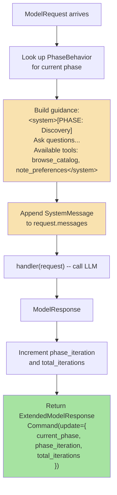
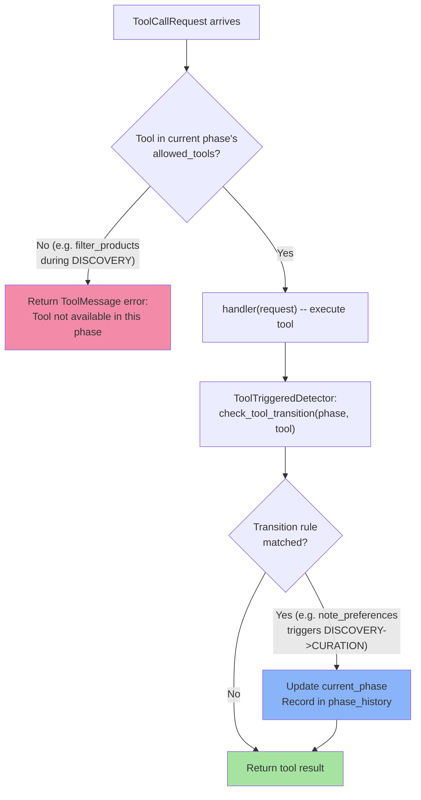
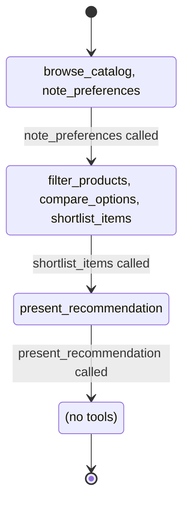

# Tool-Triggered Phase Steering

## wrap_model_call -- Inject Phase Guidance

```mermaid
flowchart TD
    A[ModelRequest arrives] --> B["Look up PhaseBehavior<br/>for current phase"]
    B --> C["Build guidance:<br/>&lt;system&gt;[PHASE: Discovery]<br/>Ask questions...<br/>Available tools: browse_catalog, note_preferences&lt;/system&gt;"]
    C --> D["Append SystemMessage<br/>to request.messages"]
    D --> E["handler(request) -- call LLM"]
    E --> F[ModelResponse]
    F --> G["Increment phase_iteration<br/>and total_iterations"]
    G --> H["Return ExtendedModelResponse<br/>Command(update={<br/>  current_phase,<br/>  phase_iteration,<br/>  total_iterations<br/>})"]

    style C fill:#f9e2af
    style D fill:#f9e2af
    style H fill:#a6e3a1
```

## wrap_tool_call -- Enforce Allow-Lists and Trigger Transitions

```mermaid
flowchart TD
    A[ToolCallRequest arrives] --> B{"Tool in current phase's<br/>allowed_tools?"}
    B -- "No (e.g. filter_products<br/>during DISCOVERY)" --> C["Return ToolMessage error:<br/>Tool not available in this phase"]
    B -- Yes --> D["handler(request) -- execute tool"]
    D --> E["ToolTriggeredDetector:<br/>check_tool_transition(phase, tool)"]
    E --> F{"Transition rule<br/>matched?"}
    F -- "Yes (e.g. note_preferences<br/>triggers DISCOVERY->CURATION)" --> G["Update current_phase<br/>Record in phase_history"]
    F -- No --> H[Return tool result]
    G --> H

    style C fill:#f38ba8
    style G fill:#89b4fa
    style H fill:#a6e3a1
```

## Phase Progression

```mermaid
stateDiagram-v2
    [*] --> DISCOVERY
    DISCOVERY --> CURATION : note_preferences called
    CURATION --> RECOMMENDATION : shortlist_items called
    RECOMMENDATION --> COMPLETE : present_recommendation called
    COMPLETE --> [*]

    DISCOVERY : browse_catalog, note_preferences
    CURATION : filter_products, compare_options, shortlist_items
    RECOMMENDATION : present_recommendation
    COMPLETE : (no tools)
```
