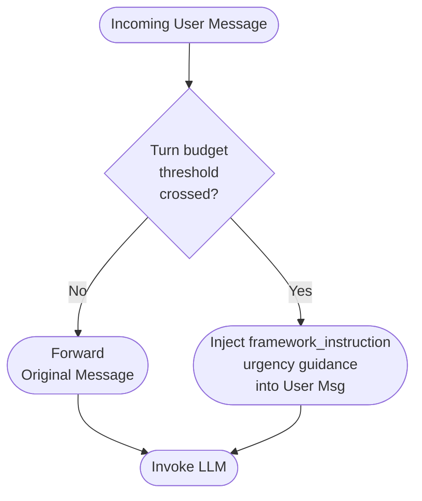

# Turn Urgency

```mermaid
flowchart TD
    A(["Incoming User Message"]) --> B{"Turn budget<br/>threshold<br/>crossed?"}
    B -- No --> C(["Forward<br/>Original Message"])
    B -- Yes --> D(["Inject framework_instruction<br/>urgency guidance<br/>into User Msg"])
    C --> E(["Invoke LLM"])
    D --> E
```
