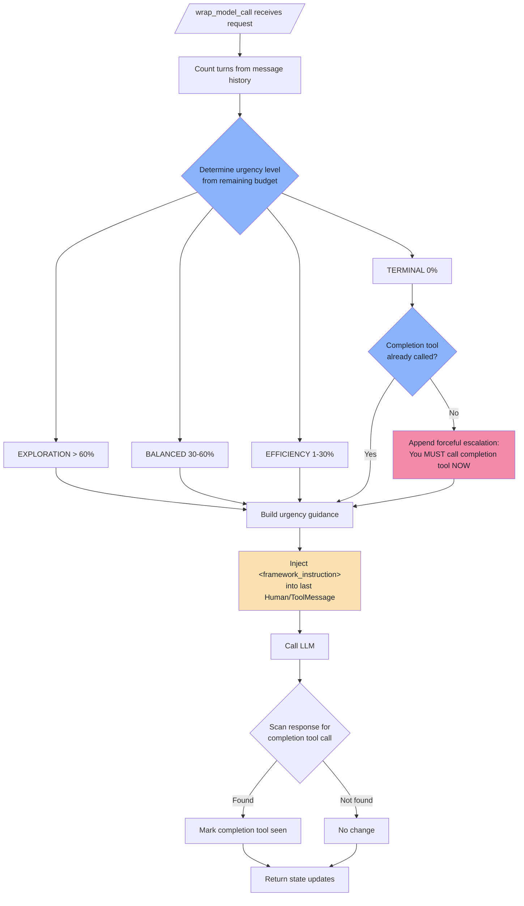

# Turn Urgency Middleware

```mermaid
flowchart TD
    A[/"wrap_model_call receives request"/] --> B["Count turns from message history"]
    B --> C{"Determine urgency level<br/>from remaining budget"}

    C --> D["EXPLORATION > 60%"]
    C --> E["BALANCED 30-60%"]
    C --> F["EFFICIENCY 1-30%"]
    C --> G["TERMINAL 0%"]

    D --> H
    E --> H
    F --> H

    G --> I{"Completion tool<br/>already called?"}
    I -- No --> J["Append forceful escalation:<br/>You MUST call completion tool NOW"]
    I -- Yes --> H

    J --> H["Build urgency guidance"]
    H --> K["Inject &lt;framework_instruction&gt;<br/>into last Human/ToolMessage"]

    K --> L[Call LLM]
    L --> M{"Scan response for<br/>completion tool call"}

    M -- Found --> N["Mark completion tool seen"]
    M -- Not found --> O[No change]

    N --> P[Return state updates]
    O --> P

    style C fill:#89b4fa,color:#1e1e2e
    style I fill:#89b4fa,color:#1e1e2e
    style K fill:#f9e2af,color:#1e1e2e
    style J fill:#f38ba8,color:#1e1e2e
```
