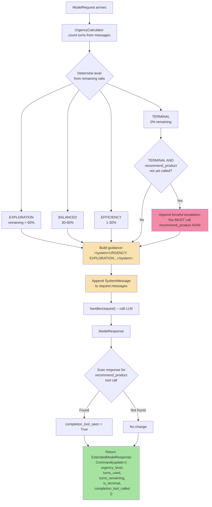

# Shopping Recommendation Agent -- Turn Urgency

```mermaid
flowchart TD
    A[ModelRequest arrives] --> B["UrgencyCalculator:<br/>count turns from messages"]
    B --> C{"Determine level<br/>from remaining ratio"}
    C --> D["EXPLORATION<br/>remaining > 60%"]
    C --> E["BALANCED<br/>30-60%"]
    C --> F["EFFICIENCY<br/>1-30%"]
    C --> G["TERMINAL<br/>0% remaining"]

    D --> H["Build guidance:<br/>&lt;system&gt;URGENCY: EXPLORATION...&lt;/system&gt;"]
    E --> H
    F --> H
    G --> I{"TERMINAL AND<br/>recommend_product<br/>not yet called?"}
    I -- Yes --> J["Append forceful escalation:<br/>You MUST call recommend_product NOW"]
    I -- No --> H
    J --> H

    H --> K["Append SystemMessage<br/>to request.messages"]
    K --> L["handler(request) -- call LLM"]
    L --> M[ModelResponse]
    M --> N{"Scan response for<br/>recommend_product<br/>tool call"}
    N -- Found --> O["completion_tool_seen = True"]
    N -- Not found --> P[No change]
    O --> Q["Return ExtendedModelResponse<br/>Command(update={<br/>  urgency_level,<br/>  turns_used,<br/>  turns_remaining,<br/>  is_terminal,<br/>  completion_tool_called<br/>})"]
    P --> Q

    style J fill:#f38ba8
    style H fill:#f9e2af
    style K fill:#f9e2af
    style Q fill:#a6e3a1
```
